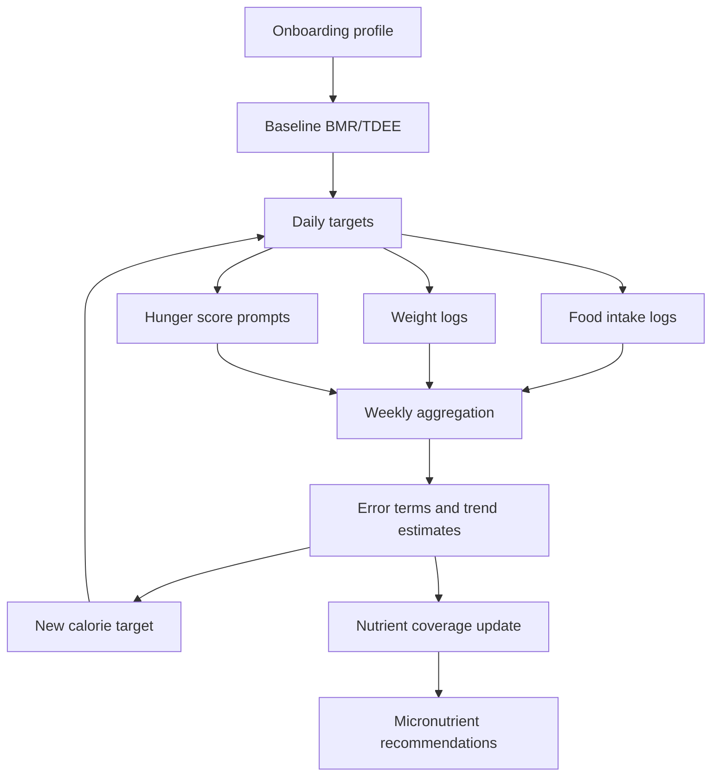

# Calculations Improvement Plan

## Goal
Replace the current fixed calculation model with an adaptive system that updates calorie, weight, and micronutrient targets from real user data.

The current onboarding logic uses a static $TDEE \pm 500\,\mathrm{kcal}$ rule. That is a good starting point, but it does not adapt to:

- weekly weight change
- daily hunger / fullness feedback
- differences between estimated BMR/TDEE and the user's actual energy expenditure
- whether the user is progressing too slowly or can tolerate a larger deficit
- vitamin and mineral intake, which is currently static and not recalculated from the user's actual food pattern

### Baseline notation

Let

$$
\begin{aligned}
BMR &= \text{basal metabolic rate} \\
TDEE &= BMR \cdot a \\
I_d &= \text{intake on day } d \\
W_d &= \text{body weight on day } d \\
H_d &= \text{hunger score on day } d
\end{aligned}
$$

where $a$ is the activity multiplier.

## Core Idea
Keep the existing BMR/TDEE estimate as the baseline, then adjust it every week using actual outcomes.

The system should act like a lightweight adaptive controller:

- estimate a starting target from BMR, activity level, and goal
- collect daily food intake, weight, hunger feedback, and nutrient totals
- compute weekly calorie delta, weekly weight delta, and nutrient coverage deltas
- update the next week's calorie target based on the gap between predicted and actual results
- keep the target aligned with the user goal, especially for fat loss where intake must still stay net negative

### Weekly update model

For a week $k$, define

$$
\Delta W_k = W_{k, end} - W_{k, start}
$$

$$
\Delta I_k = \sum_{d=1}^{7} I_d - 7 \cdot TDEE_k
$$

and the implied energy balance estimate

$$
\hat{E}_k = 7700 \cdot \Delta W_k + \Delta I_k
$$

The next calorie target can be expressed as

$$
T_{k+1} = \mathrm{clamp}(T_k + \alpha_w + \alpha_h + \alpha_a + \alpha_c, T_{min}, T_{max})
$$

where the adjustment terms are derived from weight, hunger, adherence, and confidence.

## Data To Track
Store or derive these values every day:

- body weight
- calorie intake
- calorie target used that day
- estimated maintenance calories for that day
- hunger / emptiness score, for example `1-5`
- goal type and target weight
- macro totals: calories, protein, carbs, fat, fiber
- micronutrient totals: vitamin and mineral intake

Optional but useful:

- training days vs rest days
- sleep quality
- step count or activity level changes
- adherence score, meaning how often the user stayed close to the target
- meal timing and pre-bed intake
- perceived recovery or fatigue

## Weekly Calculation Loop
Every 7 days, calculate the following quantities:

$$
I_k = \sum_{d=1}^{7} I_d
$$

$$
\Delta W_k = W_{k, end} - W_{k, start}
$$

$$
\Delta I_k = I_k - 7\cdot M_k
$$

where $I_k$ is the observed weekly intake and $M_k$ is the modelled daily maintenance intake for week $k$.

The weekly calorie error can then be written as

$$
e_k = I_k - M_k
$$

The coverage ratios for macros and micronutrients are

$$
\rho_{macro} = \frac{A_{macro}}{T_{macro}}
\qquad\text{and}\qquad
\rho_{micro} = \frac{A_{micro}}{T_{micro}}
$$

Then the weight-based correction may be written as

$$
\alpha_w = k_w (\Delta W^* - \Delta W_k)
$$

with planned weekly weight change $\Delta W^*$.

For fat loss, the goal is

$$
\Delta I_k < 0
$$

Convert weight change into an implied energy balance estimate using a conservative conversion factor:

$$
1\,\mathrm{kg\ fat} \approx 7700\,\mathrm{kcal}
$$

Then compare:

$$
   ext{expected change from calories} \quad \text{vs.} \quad \text{actual change from scale weight}
$$

If they disagree over multiple weeks, reduce trust in the static estimate and move the target closer to the observed data.

Useful derived quantities:

$$
E_{gap} = 7700\cdot \Delta W_k + \Delta I_k
$$

$$
\bar{W}_k = \frac{1}{7}\sum_{d=1}^{7} W_d
\qquad\text{and}\qquad
\bar{I}_k = \frac{1}{7}\sum_{d=1}^{7} I_d
$$

## Adaptive Target Update
Use a new weekly target:

$$
T_{k+1} = T_k + \alpha_w + \alpha_h + \alpha_a + \alpha_c
$$

A more explicit version is:

$$
T_{k+1} = \mathrm{clamp}(T_k + \Delta_{weight} + \Delta_{hunger} + \Delta_{adherence} + \Delta_{confidence}, T_{min}, T_{max})
$$

### 1. Weight-based adjustment
If the user is losing slower than intended, decrease intake further.

If the user is losing faster than intended and feels too empty, increase intake slightly, but only within the goal range.

Example rule:

$$
\Delta W_k > \Delta W^* \implies T_{k+1} = T_k - (100\text{ to }200)\,\mathrm{kcal/day}
$$

$$
\Delta W_k < \Delta W^* \wedge H_k \text{ high} \implies T_{k+1} = T_k + (100\text{ to }200)\,\mathrm{kcal/day}
$$

Formula sketch:

$$
\Delta_{weight} = k_w \cdot (\Delta W^* - \Delta W_k)
$$

where $k_w$ is a small gain factor, for example $0.1$--$0.3$ after unit normalization.

### 2. Hunger-based adjustment
Prompt the user each day with a short question such as:

- ``How empty do you feel today?`` on a scale from $1$ to $5$

Use the weekly average hunger score to decide how aggressive the next adjustment can be.

Example:

- low hunger: allow a larger deficit if weight loss is behind schedule
- medium hunger: stay conservative
- high hunger: slow down the deficit or hold the current target

Formula sketch:

$$
\Delta_{hunger} = k_h \cdot (H_k - H^*)
$$

With a scale like $1$--$5$, a low score should make the cut more aggressive, while a high score should reduce the cut.

### 3. Adherence-based adjustment
If the user regularly misses the target, reduce aggressiveness and improve the estimate first.

If adherence is good and the weight trend still stalls, the target can be adjusted more confidently.

Formula sketch:

$$
\Delta_{adherence} = k_a \cdot (A_k - A^*)
$$

### Critical: Distinguish Adherence Failures from Target Miscalibration
When actual weight change is worse than expected, the system must distinguish between two scenarios:

**Scenario A: User overate (adherence failure)**
- Actual intake $I_k > T_k$ (exceeded target)
- Weight gain occurred, but would have been loss if target had been met
- System response: Penalize adherence, do not reduce calorie target

**Scenario B: User met target but still gained weight (target miscalibration)**
- Actual intake $I_k \approx T_k$ (close to target)
- Weight still worse than expected from energy balance
- System response: Reduce calorie target because estimated TDEE or maintenance is too high

To distinguish, compute the adherence-driven weight error:

$$
\Delta I_{ad} = I_k - T_k \quad \text{(intake surplus over target)}
$$

$$
\Delta W_{ad} = \frac{\Delta I_{ad} \times 7}{7700} \quad \text{(predicted weight delta from adherence gap)}
$$

$$
\Delta W_{unexplained} = \Delta W_k - \Delta W_{ad} \quad \text{(remaining weight gap after accounting for overeating)}
$$

If $|\Delta W_{unexplained}| < \text{tolerance}$ (e.g., $0.2\,\mathrm{kg}$), the issue is adherence:

$$
\alpha_w = 0 \quad \text{(do not reduce calorie target)}
$$

$$
\alpha_a = k_a \cdot \text{(large penalty for adherence failure)}
$$

If $|\Delta W_{unexplained}| > \text{tolerance}$, the target itself needs correction:

$$
\alpha_w = k_w \cdot (\Delta W^* - \Delta W_{unexplained}) \quad \text{(adjust based on unexplained gap)}
$$

$$
\alpha_a = k_a \cdot (\text{smaller penalty, adherence was close})
$$

This ensures the system does not penalize the calorie target when the user simply overate, preserving the integrity of the target for weeks when adherence is better.

## Goal Constraints
The dynamic system must never violate the goal direction.

For weight loss:

- stay below maintenance on average
- never convert the target into a surplus unless the goal changes
- if the user is comfortable and fat reserves support it, the deficit can become larger

Formula guard:

$$
T_k \le M_k - D_{min}
$$

For weight gain:

- stay above maintenance on average
- do not swing wildly week to week

Formula guard:

$$
T_k \ge M_k + S_{min}
$$

For maintenance:

- keep the target centered around observed maintenance calories

Formula guard:

$$
T_k \approx M_k
$$

## Fat Loss Aggressiveness
When the user reports low hunger and the observed loss is slower than expected, the system should be allowed to try a stronger deficit if the estimated fat stores and recent weight trend support it.

That means the app could gradually move from a mild cut to an aggressive cut, for example toward something like `-2 kg/week` only if all of the following are true:

- the user explicitly wants faster loss
- the hunger feedback remains low
- the weekly trend still stays within a safe range
- the target remains below maintenance

This should still be capped by safety rules and never become an extreme recommendation by default.

If the projected energy reserve allows it, the app can propose a more aggressive weekly loss target. For example, a user with a large mass and low hunger can temporarily be guided toward a stronger cut, but only after clamping the recommendation to safe bounds and verifying the trend is still healthy.

In symbolic form, a stronger cut is allowed only if

$$
H_k \le H_{low} \quad \wedge \quad \Delta W_k > \Delta W^* \quad \wedge \quad T_k < M_k
$$

## Recommended Safety Bounds
Add hard limits so the calculator cannot overreact.

Suggested bounds:

- maximum day-to-day change: $100$--$200\,\mathrm{kcal}$
- maximum weekly change: $300$--$700\,\mathrm{kcal}$
- minimum intake floor: never below a safe lower bound
- maximum deficit: constrained by body weight, sex, activity, and user preference
- confidence check: require at least $2$--$3$ weeks of data before large corrections
- micronutrient floor: if intake is consistently below the target, calorie cuts should not be the only response; nutrition quality must also be corrected

### Clamp function

$$
\mathrm{clamp}(x, l, u) = \max(l, \min(x, u))
$$

## Integration Points
### Onboarding
Replace the static $500\,\mathrm{kcal}$ delta in [app/onboarding.tsx](app/onboarding.tsx) with a baseline target model that stores:

- estimated BMR
- estimated TDEE
- starting calorie target
- a confidence seed for later recalculation

### Daily logging
Add a daily calculation record that stores intake, weight, and hunger so the next weekly update has real inputs instead of only static assumptions.

### Weekly recalculation
Add a weekly recalculation job or on-demand function that recomputes target calories from the last 7 days of data.

### Meal and nutrition summaries
Extend the current food aggregation in [utils/foodCalculations.ts](utils/foodCalculations.ts) so totals are not limited to calories and macros. The same aggregation pattern should be reused for vitamins and minerals.

### Profile and charts
Expose the updated calorie target, weekly trend, and nutrient coverage in the profile and graph screens so the user can understand why the target changed.

### System integration diagram



## Nutrient Calculation Improvements
The current nutrient helper already aggregates calories, protein, carbs, fat, and fiber. The next step is to make micronutrients first-class values instead of static profile fields.

Recommended changes:

- calculate daily vitamin and mineral totals from food entries
- compare them against target values from the user profile or dietary reference values
- compute percent-of-target for each nutrient
- surface deficits as warnings or suggestions

Formula sketch for each nutrient $n$:

$$
\mathrm{coverage}_n = \frac{A_n}{T_n}
$$

$$
g_n = \max(0, T_n - A_n)
$$

For display, clamp the coverage to a reasonable range and group low values into actionable categories such as ``below target``, ``near target``, and ``covered``.

## Where Calculations Should Be Improved Or Introduced
- [app/onboarding.tsx](app/onboarding.tsx): replace fixed calorie offset with adaptive baseline target setup
- [utils/foodCalculations.ts](utils/foodCalculations.ts): extend nutrient aggregation to include vitamins and minerals
- [types/types.ts](types/types.ts): add computed types for weekly trend summaries, calorie deltas, and nutrient coverage
- database layer: introduce persisted daily snapshots for weight, intake, and hunger so weekly recalculation has source data
- graph screens: render trend lines for calories, weight, and nutrient coverage rather than only static summaries

## Implementation Phases
### Phase 1: Replace the fixed delta
Move onboarding from a fixed $500\,\mathrm{kcal}$ rule to a baseline target that can be updated later.

### Phase 2: Add daily signals
Store daily weight, calorie intake, hunger score, and nutrient totals.

### Phase 3: Weekly recalculation
Create a weekly job or on-demand calculation that updates target calories from the previous 7 days.

### Phase 4: Adaptive feedback
Use hunger and adherence to tune how aggressive the next target can be.

### Phase 5: Goal-aware recommendations
If the user is tolerating the cut well and the trend supports it, suggest a more aggressive weekly loss target.

### Phase 6: Micronutrient adaptation
Move vitamin and mineral targets away from static defaults by recalculating them from food quality, intake gaps, and goal-specific needs.

## Required Code Changes
This chapter outlines the specific modifications needed to implement the adaptive calculation system.

### UI Changes
#### Onboarding Screen
Modify [app/onboarding.tsx](app/onboarding.tsx) to store baseline BMR, TDEE, and confidence instead of computing a fixed calorie offset.

Current behavior:

```
targetCalories = TDEE +/- 500 kcal  (static offset)
```

New behavior:

```
profile.estimatedBMR = calculateBMR(gender, age, weight, height)
profile.estimatedTDEE = estimatedBMR * activityMultiplier
profile.targetCalories = estimatedTDEE - goalOffset
profile.confidenceLevel = 0.5  // Start conservative
profile.targetCaloriesUpdatedAt = now()
profile.lastWeeklyRecalculation = null
```

#### Daily Hunger Prompt
Add a daily modal or card that appears once per day after logging food, asking:

```
Question: "How empty do you feel right now?"
Scale: 1 = Very full | 2 | 3 = Neutral | 4 | 5 = Very empty
Action: Save hungerScore to daily snapshot with timestamp
```

Store the hunger score in a new table or as part of the daily summary, keyed by date.

#### Weight Input Screen
Enhance the existing weight logging to record daily weight snapshots for weekly trend analysis.

Current: weight entered on profile screen

New: Add a daily weight logging prompt or quick-entry button that stores

$$
(date, W_d, timestamp)
$$

#### Nutrient Coverage Dashboard
Update the food graphs and profile screens to show:

- Coverage ratios $\rho_n$ for each micronutrient
- Visual indicator (e.g., color) if $\rho_n < 0.8$ (80% of target)
- Weekly trend line for calorie intake vs. target
- Adherence score and adjustment reason (why target changed last week)

Pseudocode for rendering coverage:

```
for each nutrient n:
  actualIntake = sumNutrientFromMeals(date_range)
  targetIntake = userProfile.target_n
  coverage_n = actualIntake / targetIntake
  
  if coverage_n < 0.8:
    showWarning(nutrient_name, gap_n)
  else if coverage_n >= 0.8 and coverage_n <= 1.2:
    showGreen(nutrient_name)
  else:
    showYellow(nutrient_name, "exceeds target")
```

#### Weekly Summary Card
Display the weekly adjustment calculation so the user understands why the calorie target changed.

Example card:

```
Week 1: Target 2000 kcal
  Intake:      -50 kcal (vs plan)
  Weight loss: +0.2 kg (planned -0.5)
  Hunger:      3/5 (moderate)
  
Week 2 Target: 2000 - 100 = 1900 kcal (adjusted for slower loss)
Reason: Actual weight loss lagged plan.
```

### Data Pipeline and Database Changes
#### Database Schema Additions
Add tables or fields to support daily snapshots and weekly recalculation history.

New table: `DailySnapshot`

```sql
DailySnapshot (
  id,
  userId,
  date (DATE),
  weight (DECIMAL),
  calorieIntake (INT),
  calorieTarget (INT),
  hungerScore (INT, 1-5),
  macroIntake { calories, protein, carbs, fat, fiber },
  micronutrientIntake { all vitamins and minerals },
  createdAt (TIMESTAMP),
  updatedAt (TIMESTAMP)
)
```

New table: `WeeklyRecalculation`

```sql
WeeklyRecalculation (
  id,
  userId,
  weekStartDate (DATE),
  weekEndDate (DATE),
  
  weightDelta (DECIMAL),
  intakeDelta (INT),
  energyGap (INT),
  
  adjustmentWeight (INT),
  adjustmentHunger (INT),
  adjustmentAdherence (INT),
  adjustmentConfidence (INT),
  
  oldTarget (INT),
  newTarget (INT),
  
  createdAt (TIMESTAMP)
)
```

Extend `UserProfile` table:

```sql
UserProfile (
  ... existing fields ...
  estimatedBMR (DECIMAL),
  estimatedTDEE (DECIMAL),
  confidenceLevel (DECIMAL, 0-1),
  targetCaloriesUpdatedAt (TIMESTAMP),
  lastWeeklyRecalculation (DATE),
  micronutrientCalculationMethod (VARCHAR)
)
```

#### Food Aggregation Extension
Extend [utils/foodCalculations.ts](utils/foodCalculations.ts) to compute micronutrient totals alongside macros.

Current function:

```typescript
function calculateMealTotals(entries: FoodEntry[]): MacroTotals
```

New function:

```typescript
function calculateNutrientTotals(
  entries: FoodEntry[], 
  dateRange: [Date, Date]
): NutrientTotals & MicronutrientTotals {
  
  let totals = {
    calories: 0, protein: 0, carbs: 0, fat: 0, fiber: 0,
    vitaminA: 0, vitaminC: 0, vitaminD: 0, ..., zinc: 0
  }
  
  for entry in entries:
    multiplier = entry.quantity / entry.servingSize
    for each nutrient n:
      totals[n] += entry.foodItem[n] * multiplier
  
  return totals
}
```

#### Daily Snapshot Service
Create a new service [services/dailySnapshotService.ts](services/dailySnapshotService.ts) to persist daily data.

Pseudocode:

```typescript
async function recordDailySnapshot(userId: string, date: Date) {
  intake = calculateNutrientTotals(
    getMealLogsForDate(userId, date),
    [date, date]
  )
  weight = getLatestWeightForDate(userId, date)
  hunger = getHungerScoreForDate(userId, date)
  target = getUserProfile(userId).targetCalories
  
  snapshot = {
    userId,
    date,
    weight,
    calorieIntake: intake.calories,
    calorieTarget: target,
    hungerScore: hunger ?? null,
    macroIntake: { calories, protein, carbs, fat, fiber },
    micronutrientIntake: { vitaminA, vitaminC, ..., zinc }
  }
  
  await db.insert('DailySnapshot', snapshot)
}
```

#### Weekly Recalculation Job
Create a weekly scheduled job or on-demand function [services/weeklyRecalculationService.ts](services/weeklyRecalculationService.ts).

Pseudocode:

```typescript
async function recalculateWeeklyTarget(userId: string, weekEndDate: Date) {
  weekStart = weekEndDate - 7 days
  
  // Fetch week's snapshots
  snapshots = getSnapshotsForRange(userId, weekStart, weekEndDate)
  profile = getUserProfile(userId)
  
  // Calculate aggregates
  W_start = snapshots[0].weight
  W_end = snapshots[6].weight
  I_k = sum(snapshot.calorieIntake for all snapshots)
  T_k = sum(snapshot.calorieTarget for all snapshots)
  M_k = 7 * profile.estimatedTDEE
  
  deltaW = W_end - W_start
  deltaI = I_k - M_k
  E_gap = (7700 * deltaW) + deltaI
  
  // NEW: Distinguish adherence failures from target miscalibration
  deltaI_adherence = I_k - T_k  // How much more user ate than target
  deltaW_adherence = (deltaI_adherence * 7) / 7700  // Weight delta from overeating
  deltaW_unexplained = deltaW - deltaW_adherence  // Weight gap after adherence
  
  adherenceTolerance = 0.2  // kg
  
  if (abs(deltaW_unexplained) < adherenceTolerance) {
    // Weight gain/loss explained by adherence gap → don't adjust target
    alpha_w = 0
    alpha_a = k_a * (large_penalty) // User overate; strong adherence feedback
  } else {
    // Weight gap not explained by adherence → adjust target
    alpha_w = k_w * (W_planned - deltaW_unexplained)  // Use unexplained gap
    alpha_a = k_a * (small_penalty) // Adherence was close; smaller penalty
  }
  
  // Other adjustments as before
  H_avg = mean(snapshot.hungerScore for all snapshots)
  alpha_h = k_h * (H_avg - H_ref)
  alpha_c = calculateConfidence(userId)
  
  // Clamp new target
  oldTarget = profile.targetCalories
  newTarget = clamp(
    oldTarget + alpha_w + alpha_h + alpha_a + alpha_c,
    T_safe_min,
    M_k / 7 - D_min
  )
  
  // Store recalculation record
  await db.insert('WeeklyRecalculation', {
    userId, weekStart, weekEnd,
    weightDelta: deltaW,
    intakeDelta: deltaI,
    energyGap: E_gap,
    adherenceDelta: deltaI_adherence,
    weightAdherenceDelta: deltaW_adherence,
    weightUnexplained: deltaW_unexplained,
    adjustmentWeight: alpha_w,
    adjustmentHunger: alpha_h,
    adjustmentAdherence: alpha_a,
    adjustmentConfidence: alpha_c,
    oldTarget,
    newTarget
  })
  
  // Update user profile
  await updateUserProfile(userId, {
    targetCalories: newTarget,
    targetCaloriesUpdatedAt: now(),
    lastWeeklyRecalculation: weekEndDate,
    confidenceLevel: min(1.0, profile.confidenceLevel + 0.05)
  })
}
```
    confidenceLevel: min(1.0, profile.confidenceLevel + 0.05)
  })
}
```

#### Micronutrient Target Computation
Extend or create [services/nutrientTargetService.ts](services/nutrientTargetService.ts) to compute targets adaptively.

Using the formula

$$
\text{target}_n^{\text{new}} = \text{target}_n^{\text{base}} \cdot g_{\text{goal}} \cdot g_{\text{quality}}
$$

Pseudocode:

```typescript
async function recalculateMicronutrientTargets(
  userId: string, 
  profile: UserProfile
): Micronutrients {
  
  // Base targets from dietary references
  baseTargets = getDietaryReferenceValues(profile)
  
  // Goal modifier: increase if cutting aggressively
  goalMod = profile.goalType === 'lose-weight' ? 1.15 : 1.0
  
  // Quality modifier: if recent intake is poor, raise emphasis
  recentCoverage = getAverageCoverage(userId, last_14_days)
  qualityMod = recentCoverage < 0.9 ? 1.2 : 1.0
  
  for each nutrient n:
    targets[n] = baseTargets[n] * goalMod * qualityMod
  
  return targets
}
```

#### Integration into Meal Logging
Update [app/(tabs)/(food)/index.tsx](app/(tabs)/(food)/index.tsx) and related meal screens to:

1. After meal is logged, call `recordDailySnapshot()` to update daily totals
2. Display updated nutrient coverage badges
3. Show how much further they are from their daily targets

Pseudocode:

```typescript
async function handleMealLogged(mealLog: MealLog) {
  // Save the meal
  await saveMealLog(mealLog)
  
  // Update daily snapshot
  await recordDailySnapshot(userId, mealLog.date)
  
  // Fetch updated coverage
  snapshot = await getDailySnapshot(userId, mealLog.date)
  coverage = calculateCoverage(snapshot, profile)
  
  // Display feedback
  displayNutrientCoverage(coverage)
  displayCalorieProgress(snapshot)
}
```

#### Weekly Recalculation Trigger
Add a scheduled job (e.g., using Expo's background task API or a server cron job):

```typescript
// Example: Check every Sunday at 21:00
scheduleWeeklyRecalculation(
  dayOfWeek: 'sunday',
  time: '21:00',
  callback: async (userId) => {
    await recalculateWeeklyTarget(userId, today())
  }
)
```

Alternatively, trigger on-demand when the user opens the dashboard or profile screen:

```typescript
async function loadProfileDashboard(userId: string) {
  profile = await getUserProfile(userId)
  
  if (shouldRecalculateThisWeek(profile)) {
    await recalculateWeeklyTarget(userId, today())
    profile = await getUserProfile(userId)  // Refresh
  }
  
  render(profile)
}
```

## Additional Changes Beyond Calories
This chapter covers improvements that are not directly about energy balance, but still matter for long-term health and better recommendations.

### 1. Protein distribution
Do not only track total protein. Track how it is distributed across meals.

$$
P_{meal,i} = \text{protein in meal } i
$$

and compare against a per-meal target such as

$$
P_{meal,target} = \frac{P_{day,target}}{m}
$$

where $m$ is the number of meals.

### 2. Fiber adequacy
Fiber should be treated as its own target with a weekly coverage score, not only as a passive macro summary.

$$
\mathrm{fiberCoverage} = \frac{F_{actual}}{F_{target}}
$$

### 3. Micronutrient risk scoring
Create a score for nutrients that are consistently below target.

$$
R_n = 1 - \mathrm{coverage}_n
$$

Then aggregate high-risk nutrients into a diet-quality score.

### 4. Hydration and sodium
If the app later tracks hydration, sodium, or electrolyte balance, those values should also be calculated against meaningful thresholds.

### 5. Recovery and training load
Calorie recommendations should eventually consider recovery signals, not only body mass.

### 6. Goal-specific nutrient bias
When the goal is aggressive fat loss, the system should raise emphasis on nutrients that are most likely to fall first, especially protein, fiber, potassium, magnesium, iron, and vitamin D.

## Suggested Formula Sketch
1. Start from

$$
T_0 = TDEE
$$

2. Apply the goal offset

$$
T_1 = T_0 - D_{goal}
$$

3. Update using weekly evidence

$$
T_{k+1} = T_k + \Delta_{weight} + \Delta_{hunger} + \Delta_{adherence} + \Delta_{confidence}
$$

4. Clamp the result

$$
T_{k+1} = \mathrm{clamp}(T_{k+1}, T_{safe,min}, M_k - D_{min})
$$

For micronutrients,

$$
N_{target} = N_{base} \cdot g_{goal} \cdot g_{quality}
$$

This lets the app raise emphasis on nutrients that commonly drop when calories are reduced, especially for aggressive cuts.

## Outcome
This gives the app a closed-loop calorie system instead of a static estimate.

The result should be:

- more accurate over time
- more personalized to the user
- more responsive to hunger and compliance
- safer than blindly pushing one fixed deficit forever
- better at protecting micronutrient adequacy while calories change
